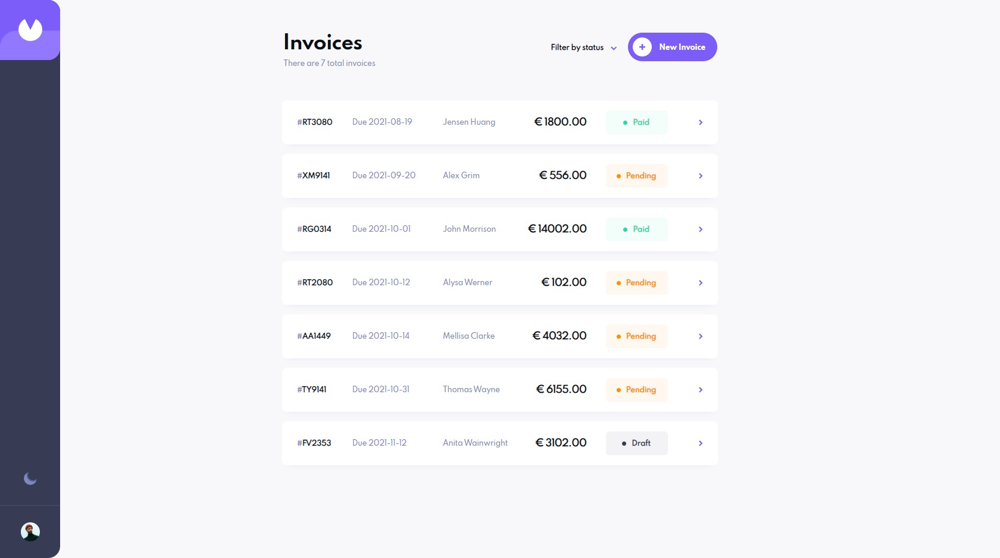

# Frontend Mentor - Invoice app solution

## Live Site URL: [Demo](https://daanwarming.github.io/Invoice-App/)

This is a solution to the [Invoice app challenge on Frontend Mentor](https://www.frontendmentor.io/challenges/invoice-app-i7KaLTQjl). Frontend Mentor challenges help you improve your coding skills by building realistic projects. 

## Table of contents

- [Overview](#overview)
  - [The challenge](#the-challenge)
  - [Screenshot](#screenshot)
  - [Links](#links)
  - [Built with](#built-with)
- [Author](#author)

## Overview

### The challenge

Users should be able to:

- View the optimal layout for the app depending on their device's screen size
- See hover states for all interactive elements on the page
- Create, read, update, and delete invoices
- Receive form validations when trying to create/edit an invoice
- Save draft invoices, and mark pending invoices as paid
- Filter invoices by status (draft/pending/paid)
- Toggle light and dark mode
- **Bonus**: Keep track of any changes, even after refreshing the browser (`localStorage` could be used for this if you're not building out a full-stack app)

### Screenshot

### Links

- Repository URL: [Repository](https://github.com/DaanWarming/Invoice-App)
- Live Site URL: [Demo](https://daanwarming.github.io/Invoice-App/)
- Solution URL: [Add solution URL here](https://your-solution-url.com)

### Built with

- Semantic HTML5 markup
- Flexbox
- CSS Modules
- Mobile-first workflow
- [React](https://reactjs.org/) - React framework

## Author

- Website - [Daan Warming](https://www.your-site.com)
- Frontend Mentor - [@DaanWarming](https://www.frontendmentor.io/profile/yourusername)
- Linkedin - [@DaanWarming](https://www.linkedin.com/in/daan-warming-613932175/)

